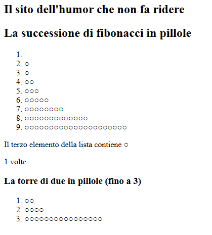

# Esercitazione 2 - Javascript

Come per l'esercitazione precedente, in questa esercitazione occorre implementare le funzioni
definite nel file `js/script.js`.

Il risultato deve corrispondere allo screenshot che vedete in figura:



In particolare va aggiunta la seguente consegna:

> Occorre completare il paragrafo, calcolando il numero di caratteri "○" che compaiono al terzo
> elemento della lista che avete a disposizione
>
> Occorre inoltre generare una lista simile, ma che al posto di basarsi sulla successione di
> Fibonacci si basa sulla funzione towerOfTwo (fornita insieme al codice)
>
> Il paragrafo sotto la scritta "Il terzo elemento della lista contiene ○" deve aver scritto
> "1 volte".

Per svolgere la consegna dovete capire come ottenere e manipolare elementi del DOM.

## Eseguire gli script come ultima operazione

Per permettere l'esecuzione di codice Javascript che agisce sul DOM, occorre che lo script
venga eseguito come ultima operazione. Per ottenere ciò abbiamo 2 opzioni:

1. Mettere tutti gli `<script>` alla fine del body
 
   > In questa esercitazione è stata usata questa opzione per i test automatici fatti dal
   > professore.
2. Contrassegnare gli script in questione con l'attributo `defer` (in italiano "differisci"
   -> fai dopo)
   ``` Javascript
   <script src="js/script.js" defer></script>
   ```

   > In questa esercitazione è stata usata questa opzione per il lavoro dello studente.

Le due opzioni sono assolutamente identiche! Una non è meglio dell'altra, come sempre vince
la **LEGGIBILIT&Aacute;**

## Cosa è il DOM?

DOM è l'acronimo che sta per **Document Object Model**, e rappresenta la struttura in cui è
organizzata ogni pagina web.

Definito dal W3C, la sua conoscenza offre il pieno controllo di una pagina web, ed è quindi
la base per creare applicazioni in `HTML` e `JavaScript`, con l'ambizione di pervenire alla
scrittura di un codice universale per tutti i browser.

Ecco un esempio per una pagina con questo codice HTML:

``` HTML
<html>
  <head>
    <title>il DOM</title>
  </head>
  <body>
     <a href="pagina.html">Ciao</a>
  </body>
</html>
```

Il DOM considera questa, come ogni altra pagina, secondo le relazioni che legano e collegano
i vari elementi del documento, evidenziandone le parentele e le caratteristiche.

La pagina è costituita da nodi, in sostanza ogni cosa presente nella pagina, ogni tag (come
`<title>`), ogni testo (come `Ciao`) è un nodo.


## Selezionare gli elementi del DOM - Parte 1

Il DOM viene rappresentato in Javascript tramite l'oggetto `document`, che
rappresenta anche il nodo radice (ovvero `<html>`).

Per ottenere un elemento HTML dal suo ID possiamo usare il metodo `getElementById(...)`.

Eccovi un esempio di utilizzo:

``` HTML
<!-- index.html -->
<html>
  <head>
    <script src="prova.js"></script> <!-- incluso come prova -->
  </head>
  <body>
    <p>
      Prova 1
    </p>
    <p class="prova">
      Prova 2
    </p>
    <p id="prova-id" class="prova">
      Prova 2
    </p>
  </body>
</html>
```

``` javascript
/* prova.js */
const p_id = document.getElementById("prova-id");
```

## Manipolare gli elementi del DOM

Il DOM può essere anche manipolato, oltre che letto. A tale scopo si fa notare che ci sono funzioni per

- Creare nuovi elementi (tag)
- Manipolare elementi esistenti

Vediamo prima come creare nuovi elementi:

la proprietà `.innerHTML` permette di settare una stringa HTML come contenuto interno di un elemento,
mentre la proprietà `.innerText` permette di settare una stringa testuale.

``` HTML
<html>
  <head>
    <!-- ... -->
  </head>
  <body>
    <div id="container"></div>
  </body>
</html>
```

``` javascript
const container = document.getElementById("container");

const html_string = "<p id='new-p' class='cool-text'>BOOYAH!</p>";
container.innerHTML += html_string;
```

&Egrave; possibile sfruttare questo concetto anche per popolare liste di elementi

``` HTML
<html>
  <head>
    <!-- ... -->
  </head>
  <body>
    <ol id="lista"></div>
  </body>
</html>
```

``` Javascript
const elements = ["uno", "due", "tre"];

let temp = "";

for (let i = 0; i < elements.length; i++) {
  temp += "<li>" + elements[i] + "</li>";
}

const list = document.getElementById("lista");
list.innerHTML = temp; // Sostituiamo il contenuto!
```

> `.innerHTML` è una proprietà potente, ma pericolosa: molti tentativi di hacking passano da un
> uso improprio di questa proprietà!
>
> Se non dovete impostare codice HTML, usate `.innerText`!

Ci sono altri modi di creare elementi HTML, ma per ora ci fermiamo a questo.

> Esercitazione a opera di [***Alessandro Sanino***](https://linkedin.com/in/alessandrosanino)
