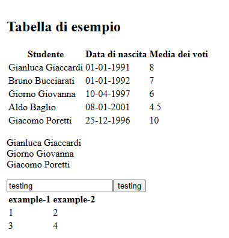

# Esercitazione 3 bis- Javascript

Come per l'esercitazione precedente, in questa esercitazione occorre implementare le funzioni
definite nel file `js/script.js`.

Ci si dovrebbe aspettare un layout finale come nel seguente screenshot



In particolare, si evidenzia la seguente consegna:

> Avete una tabella di esempio, per la prima funzione `paragraphWithEvenRows` dovete prendere
> in considerazione tutte le righe pari e andare a capo a ogni riga
>
> `createTextInput` crea un input tag di tipo testuale impostando l'id al valore specificato
> come parametro
>
> `createCustomizableButton` crea un bottone il cui contenuto consiste nel valore contenuto all'interno
> dell'input tag creato in precedenza (gli id vengono passati automaticamente come parametro)
>
> `createTable` crea una tabella dinamicamente, a partire dai parametri specificati (table_id, nomi
> delle colonne, un array di righe = array di array di stringhe con i dati delle celle)

I test vengono eseguiti automaticamente, non dovete far nulla, le funzioni vengono richiamate in
automatico!

> Ricordatevi che tutti gli elementi vanno aggiunti al fondo del contenitore con id "student-area"!

## Selezionare gli elementi del DOM - Parte 2

Abbiamo visto che il DOM viene rappresentato in Javascript tramite l'oggetto `document`, che
rappresenta anche il nodo radice (ovvero `<html>`).

Abbiamo anche visto che con `getElementById(...)` possiamo ottenere un elemento dal suo ID.

Ma c'è tutta un'altra serie di funzioni utili agli scopi più disparati:

- `getElementsByClassName(class_name)` -> permette di recuperare l'insieme degli elementi caratterizzati dalla stesso classe.
   In particolare ritorna **un array di tutti gli elementi considerati**, nell'ordine in cui compaiono nel codice della pagina.
- `getElementsByTagName(tag_name)` -> permette di recuperare l'insieme degli elementi caratterizzati dallo stesso tag.

   In particolare ritorna **un array di tutti gli elementi del tag considerato**, nell'ordine in cui compaiono nel codice della pagina.
- `querySelector(selector)` -> permette di recuperare il primo elemento catturato da un determinato **selettore CSS**
- `querySelectorAll(selector)` -> permette di recuperare **tutti gli elementi catturati da un determinato selettore CSS**

  In particolare ritorna **un array di tutti gli elementi catturati**, nell'ordine in cui compaiono nel codice della pagina.

Eccovi alcuni esempi di utilizzo:

``` HTML
<!-- index.html -->
<html>
  <head>
    <script src="prova.js"></script> <!-- incluso come prova -->
  </head>
  <body>
    <p>
      Prova 1
    </p>
    <p class="prova">
      Prova 2
    </p>
    <p id="prova-id" class="prova">
      Prova 2
    </p>
  </body>
</html>
```

``` javascript
/* prova.js */
"use strict";

// appena la pagina è completamente caricata
window.addEventListener("load", function () {
  let primo_p = document.querySelector("p");
  let primo_prova = document.querySelector(".prova");
  let p_id = document.getElementById("prova-id");
  // oppure
  p_id = document.querySelector("#prova-id");

  let tutti_i_p = document.getElementsByTagName("p");
  // oppure
  tutti_i_p = document.querySelectorAll("p");

  let tutti_prova = document.getElementsByClassName("prova");
  // oppure
  tutti_prova = document.querySelectorAll(".prova");
})
```

> Come potete vedere, `querySelector` e `querySelectorAll` possono essere utilizzati al posto di tutti
> gli altri, tuttavia è importante far notare che non funzionano sui browser più datati (vedi Internet
> Explorer)

## Manipolare gli elementi del DOM

Il DOM può essere anche manipolato, oltre che letto. A tale scopo si fa notare che ci sono funzioni per

- Creare nuovi elementi (tag)
- Manipolare elementi esistenti

Vediamo prima come creare nuovi elementi:

`createElement(tag_name)` permette di creare un nuovo elemento vuoto, con il tag specificato

la proprietà `.innerHTML` permette di settare una stringa HTML come contenuto interno di un elemento,
mentre la proprietà `.innerText` permette di settare una stringa testuale.

la funzione `.appendChild(element)` permette di aggiungere un elemento come figlio dell'elemento specificato,
al fondo.

la proprietà `.classList` contiene tutte le classi CSS di un elemento e tramite le funzioni
`.classList.add(class_name)` e `.classList.remove(class_name)` si possono aggiungere o togliere
classi CSS a un elemento.

> Esistono altre proprietà, come `.id` `.type` e `.style` che manipolano altre proprietà
> del nostro elemento.

``` javascript
const body = document.querySelector("body");
const new_p = document.createElement("p");

p.id = "new-p"; // impostiamo l'id del nuovo elemento
p.innerText = "BOOYAH!"; // impostiamo il testo del paragrafo
p.classList.add("cool-text"); // aggiungiamo una classe CSS

// <p id="new-p" class="cool-text">BOOYAH!</p>

body.appendChild(new_p); // aggiungiamo l'elemento al body, al fondo
```


> Esercitazione a opera di [***Alessandro Sanino***](https://linkedin.com/in/alessandrosanino)
