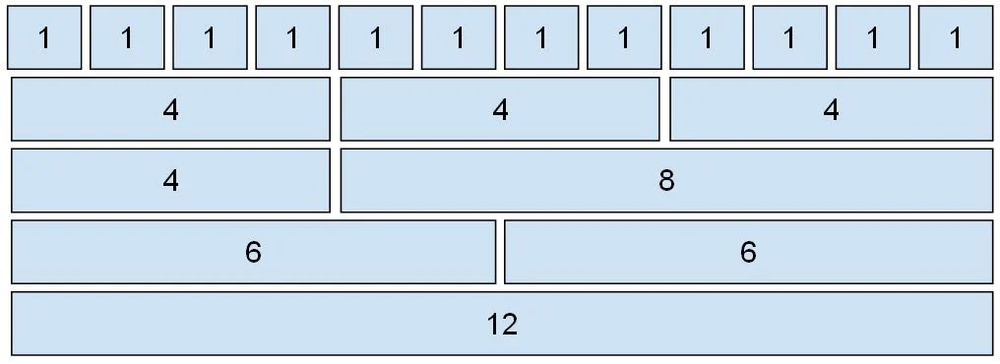

# Esercitazione 1 - Bootstrap 5

In questa esercitazione occorre implementare il sito come da seguente registrazione,
usando Bootstrap 5 e le sue potenzialità.

<video width="1000" height="600" controls>
  <source src="lesson/assets/recording.mp4" type="video/mp4">
</video>

## Bootstrap 5

Bootstrap è uno dei framework CSS più utiizzati ed imitati, nato nel nido di Twitter
ed oggi indipendente.

Bootstrap può a buon diritto considerarsi lo standard de facto dei framework CSS per
lo sviluppo di interfacce Web, trovando applicazione in ambiti come la creazione di
template HTML preconfezionati ed i temi per i principali CMS, soprattutto in un’ottica
responsiva.

A differenza delle precedenti versioni (fino alla 4) la dipendenza da Javascript per le
animazioni è stata ridotta al minimo indispensabile e resa opzionale (un paio di componenti
necessitano ancora di Javascript, come `Tooltip`, ma per ora non ce ne interessiamo)

### Come usare Bootstrap

> Si possono trovare altri modi di scaricare Bootstrap a questa pagina:
> 
> https://getbootstrap.com/docs/5.3/getting-started/download/

Bootstrap 5 è composto da molti files, sia CSS che Javascript, che dobbiamo includere nel nostro
progetto. Per fare ciò abbiamo principalmente 2 modi:

1. Scaricare i suoi files e aggiungerli al nostro server (Sezione ***"Compiled CSS and JS"***)
2. Usare le CDN (Content Delivery Networks) di Bootstrap e includere direttamente il loro URL

   ``` HTML
   <link href="https://cdn.jsdelivr.net/npm/bootstrap@5.3/dist/css/bootstrap.min.css" rel="stylesheet" integrity="sha384-rbsA2VBKQhggwzxH7pPCaAqO46MgnOM80zW1RWuH61DGLwZJEdK2Kadq2F9CUG65" crossorigin="anonymous">
   <script src="https://cdn.jsdelivr.net/npm/bootstrap@5.3/dist/js/bootstrap.bundle.min.js" integrity="sha384-kenU1KFdBIe4zVF0s0G1M5b4hcpxyD9F7jL+jjXkk+Q2h455rYXK/7HAuoJl+0I4" crossorigin="anonymous"></script>
   ```

   > Le CDN sono molto veloci a fornirci i file che ci servono, ma qualche cliente potrebbe voler salvare
   > direttamente i file di Bootstrap nel suo server per ragioni di affidabilità (e se la CDN non risponde?)

### Bootstrap Grid System

Ora che abbiamo capito come includere Bootstrap, è ora di tuffarci dentro la sua prima grande filosofia:



Il layout a 12 colonne (chiamato `Grid System`) divide la larghezza del contenitore in 12 parti uguali, e con le classi specifiche 
diciamo "quante colonne è largo il mio elemento":

- `col-3` ad esempio indica che il mio layout è largo 3 colonne
- `col-5` ad esempio indica che il mio layout è largo 5 colonne
- `col-12` ad esempio indica che il mio layout è largo 12 colonne

e così via.

### Layout responsive con Grid System

Bootstrap mette a disposizione alcune classi che si attivano automaticamente in base alla dimensione
dello schermo del device. Anch'esse si basano sul Grid System e permettono di impostare le dimensioni
in base al dispositivo (esattamente come facevamo prima con le `@media` queries)

Queste regole si costruiscono cosi:

**`col-{breakpoint}-{1-12}`**

Dove `breakpoint` può essere:

- `sm`: "small" - larghezza >= `576px` (piccoli smartphone - smartwatch)
- `md`: "medium" - larghezza >= `768px` (smartphones)
- `lg`: "large" - larghezza >= `992px` (smartphone in orizzontale - tablets)
- `xl`: "extra large" - larghezza >= `1200px` (tablets in orizzontale)
- `xxl`: "extra extra large" - larghezza >= `1400px` (Desktop computers)

> Ci sono altre classi in caso di dispositivi particolari, come le Smart TV, ma non le affronteremo.

#### Ma quindi come componiamo le classi del grid system?


Facciamo qualche esempio pratico:

``` HTML
<p class="col-md-6">6 colonne su smartphone o più grande, 12 colonne se più piccolo</p>
<p class="col-12">sempre 12 colonne</p>
<p class="col-xl-3">3 colonne su tablets in orizzontale (o più grande, 12 colonne se più piccolo) </p>

<p class="col-xl-1 col-lg-3 col-md-6 col-sm-12">
  Si applicano contemporaneamente tutte le regole
</p>
```

### container, container-fluid, row

Ora che sappiamo come strutturare il sito in larghezza, occorre solo capire come gestire varie
"righe", e i contenitori "container". Le rispettive classi ci vengono in soccorso.

``` HTML
<!--
  container si allarga a coprire tutto il suo contenitore,
  lasciando del margine a destra e sinistra. 
-->
<div class="container"> 
  <!-- 
  row permette di definire una riga.
  -->
  <div class="row">
    <!-- colonne come da grid system -->
    <div class="col-sm-6"> 6 colonne </div>
    <div class="col-sm-6"> 6 colonne </div>
  </div>
  <!--
    Se metto più righe dentro un container
    vanno a capo.
  -->
  <div class="row">
    <!-- colonne come da grid system -->
    <div class="col-sm-3"> 3 colonne </div>
    <div class="col-sm-3"> 3 colonne </div>
    <div class="col-sm-6"> 6 colonne </div>
  </div>
</div>

<!--
  container-fluid si allarga a coprire tutto
  il suo contenitore (fluido)
-->
<div class="container-fluid"> 
  <!-- per il resto funziona esattamente uguale -->
  <div class="row">
    <div class="col-sm-6"> 6 colonne </div>
  </div>
</div>
```

> Esercitazione a opera di [***Alessandro Sanino***](https://linkedin.com/in/alessandrosanino)
