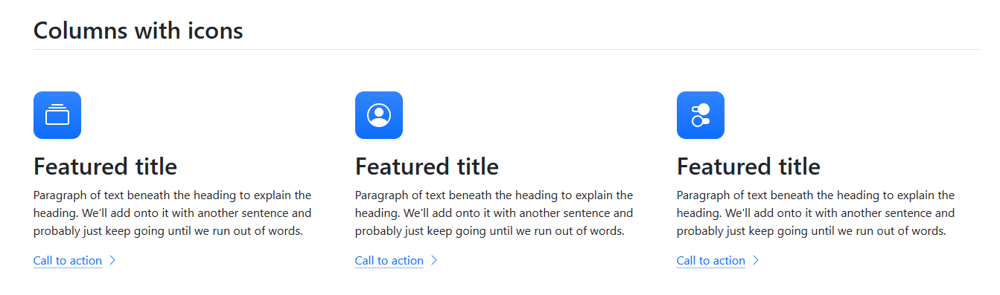
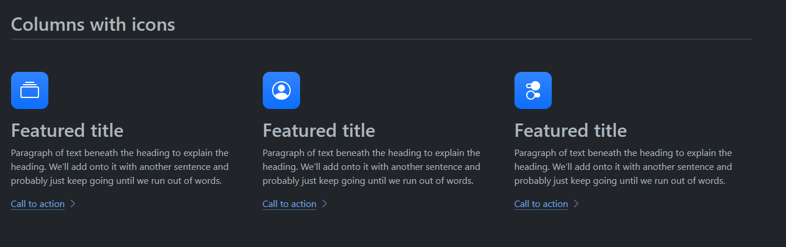
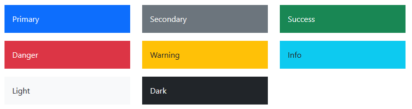
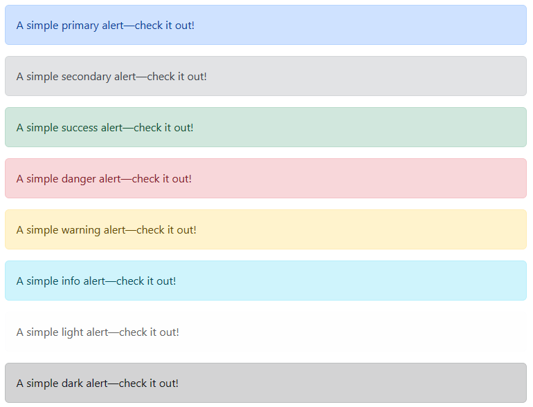
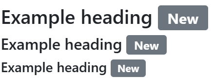

# Esercitazione 2 - Bootstrap 5

Questa esercitazione è sponsorizzata da **FUFFLIX: The best fuffa, at your fingertips**


In questa esercitazione occorre riprodurre il design come da seguente registrazione:

<video width="1000" height="600" controls>
  <source src="lesson/assets/recording.mp4" type="video/mp4">
</video>

## Bootstrap 5: Regole base e colori

Abbiamo già visto nelle esercitazioni precedenti il **Grid System**, il sistema che Bootstrap
usa per gestire sia la responsiveness che lo spazio occupato da contenitori e righe nel nostro
layout.

Ma Bootstrap non è solo questo. &Egrave; un insieme di regole e componenti che rispecchiano le
linee guida  del design e UX (User Experience) per siti web ottimizzati per mobile.

Questo include anche alcune regole e nomenclature.

### I temi bootstrap

Si definisce **TEMA** una combinazione di regole e colori che è possibile usare all'interno
di un sito.

Gli esempi più famosi di ciò sono il cosiddetto "Tema chiaro" e il "Tema scuro" (che solo di
recente ha iniziato a ricevere l'attenzione che merita nei siti).

I temi definiscono le regole dei vari componenti del nostro sito (bottoni, labels, etc...).

Eccovi un esempio pratico (che trovate all'URL https://getbootstrap.com/docs/5.3/examples/features)




#### I colori di un tema

Ogni tema è anche dotato di una color palette che è composta dai seguenti colori (che cambiano da
tema a tema)



Ogni elemento della color palette ha un significato ben preciso (tenetelo a mente, non è solo qualcosa
di visivo, ma un significato in termini di esperienza utente):

- `primary`: Contenuti di importanza primaria che devono essere visibili a colpo d'occhio. Fanno
  parte di questa categoria i bottoni principali (es. **bottoni di submit** nelle form).
- `secondary`: Contenuti di importanza secondaria che non devono risaltare, ma hanno funzioni comunque
  utili. Fanno parte di questa categoria i bottoni non essenziali (es. **bottoni di reset** nei form)
- `success`: Messaggi che informano l'utente che una operazione è avvenuta con successo, o che in
  ogni caso fanno capire che qualcosa è andato come doveva andare.
- `warning`: Messaggi che informano l'utente che qualcosa non va perfettamente, ma è possibile comunque
  proseguire (es. l'utente vuole cancellare il proprio account, prima di eseguire l'operazione si
  avvisa l'utente delle conseguenze).
- `danger`: Messaggi che informano l'utente che è avvenuto un errore che impedisce il corretto
  proseguimento dell'esperienza (es. Manca il nome in un form, che è un dato obbligatorio)
- `info`: Messaggi che informano l'utente che sta avvenendo qualcosa di cui non è obbligatorio che
  sia messo al corrente, ma può essere gradito anche se non ha nessuna conseguenza sull'esperienza
- `light` e `dark`: Con l'avvento dei nuovi temi chiaro e scuro dei browser, stanno gradualmente perdendo
  la loro utilità. Hanno principalmente la funzione di colorare di chiaro e scuro testi e componenti.  

> **BONUS**: Volete sapere come fare stili in tema scuro con il vostro CSS? Ecco qui
> ``` CSS
> @media (prefers-color-scheme: light) {
>   /* mio CSS qui (solo per il tema chiaro) *
>    * questo è anche il default             */ 
> }
>
> @media (prefers-color-scheme: dark) {
>   /* mio CSS qui (solo per il tema scuro)  */ 
> }

## Bootstrap: classi utility

In bootstrap esistono classi che si possono usare per semplificare la gestione del CSS in maniera
generale, come margini o display di elementi.

### Display utilities

In Bootstrap ci sono delle classi che permettono di cambiare il display degli elementi, dividendo
addirittura per breakpoint.

``` HTML
<div class="d-block"></div> <!-- Mostro un elemento (default) -->
<div class="d-none"></div> <!-- Nascondo un elemento -->
```

### Margin e Padding utilities

In Bootstrap ci sono delle classi che permettono di impostare margini interni ed esterni
predefiniti, dividendo addirittura per breakpoint.

Per mettere dei margini esterni la formula è la seguente:

``` HTML
<!--
  margini in tutte le direzioni, sempre:
  
  m-{numero da 1 a 5}
-->
<div class="m-1"></div>
<div class="m-2"></div>
<div class="m-3"></div>
<div class="m-4"></div>
<div class="m-5"></div>

<!-- 
  margini in una sola direzione, sempre:
  
  m{direzione}-{numero da 1 a 5}
-->
<div class="mt-1"></div> <!-- top -->
<div class="mb-2"></div> <!-- bottom -->
<div class="ms-3"></div> <!-- left (start) -->
<div class="me-4"></div> <!-- right (end) -->

<div class="mx-3"></div> <!-- orizzontale (ms + me) -->
<div class="my-4"></div> <!-- verticale (mt + mb) -->

<!--
  margini divisi per breakpoint:
  
  m{direzione}-{breakpoint}-{numero da 1 a 5} 
-->
<div class="mt-sm-1"></div> <!-- top, da sm in su -->
<div class="m-md-2"></div> <!-- tutti, da md in su -->
<div class="ms-lg-3"></div> <!-- left, da lg in su -->
<div class="me-4"></div> <!-- right, sempre -->
```

Per i margini interni il discorso è identico, ma al posto di `m` (margin) si usa
`p` (padding):

``` HTML
<div class="p-1"></div>
<div class="p-2"></div>
<div class="p-3"></div>
<div class="p-4"></div>
<div class="p-5"></div>

<div class="pt-1"></div> <!-- top -->
<div class="pb-2"></div> <!-- bottom -->
<div class="ps-3"></div> <!-- left (start) -->
<div class="pe-4"></div> <!-- right (end) -->

<div class="px-3"></div> <!-- orizzontale (ps + pe) -->
<div class="py-4"></div> <!-- verticale (pt + pb) -->

<div class="pt-sm-1"></div> <!-- top, da sm in su -->
<div class="p-md-2"></div>  <!-- tutti, da md in su -->
<div class="ps-lg-3"></div> <!-- left, da lg in su -->
<div class="pe-4"></div>    <!-- right, sempre -->
```

### Text utilities

Con le text utilities andiamo a controllare come si comporta il testo, sia come allineamento
che come stile:

``` HTML
<p class="text-center"> Io sono centrato </p>
<p class="text-end"> Io sono a destra </p>
<p class="text-start"> Io sono a sinistra </p>
<p class="text-justified"> Io sono giustificato </p>

<!-- si può anche colorare un testo seguendo un tema -->
<p class="text-primary"> Io sono un testo primario </p>
<p class="text-secondary"> Io sono un testo secondario, quindi meno importante </p>
<p class="text-success"> Io sono un testo che ti segnala che è tutto ok</p>
<!-- e così via... -->

<!-- o colorare lo sfondo ... -->
<p class="text-bg-primary"> Io sono un testo con sfondo primario </p>
<p class="text-bg-secondary"> Io sono un testo con sfondo secondario, quindi meno importante </p>
<p class="text-bg-success"> Io sono un testo con sfondo che ti segnala che è tutto ok</p>
<!-- e così via... -->
```

## I componenti Bootstrap 5: Parte 1

In questa sezione spiegheremo alcuni componenti del framework Bootstrap che saranno utili
per superare l'esercitazione di oggi.

### Bottoni

I bottoni sono un componente essenziale di qualsiasi sito, vediamo come sfruttare Bootstrap
per creare dei bottoni con un design ottimizzato.

``` HTML
<!-- qui abbiamo anche messo dei margini -->
<button class="btn btn-primary m-5">MIO BOTTONE PRIMARIO</button>
<button class="btn btn-secondary m-5">MIO BOTTONE SECONDARIO</button>
```


> Potete trovare maggiori informazioni qui: https://getbootstrap.com/docs/5.2/components/buttons

### Alerts

Gli alert sono degli ottimi modi per segnalare messaggi di qualsivoglia tipo (successo, avvisi,
pericolo, informazioni). Controllandoli con Javascript potete ottenere schermate interattive di
segnalazione.

``` HTML
<div class="alert alert-primary" role="alert">
  A simple primary alert—check it out!
</div>
<div class="alert alert-secondary" role="alert">
  A simple secondary alert—check it out!
</div>
<div class="alert alert-success" role="alert">
  A simple success alert—check it out!
</div>
<div class="alert alert-danger" role="alert">
  A simple danger alert—check it out!
</div>
<div class="alert alert-warning" role="alert">
  A simple warning alert—check it out!
</div>
<div class="alert alert-info" role="alert">
  A simple info alert—check it out!
</div>
<div class="alert alert-light" role="alert">
  A simple light alert—check it out!
</div>
<div class="alert alert-dark" role="alert">
  A simple dark alert—check it out!
</div>
```



Proviamo ora a mostrare un alert con Javascript, si prenda
come esempio il seguente codice HTML:

``` HTML
<button id="show-alert-btn">MOSTRA ALERT</button>
<!-- Notare che l'alert è nascosto (d-none) -->
<div id="message-alert" class="alert alert-info d-none" role="alert"></div> 
```

``` Javascript
window.addEventListener("load", function() {
  const show_alert_btn = document.getElementById("show-alert-btn");
  const message_alert = document.getElementById("message-alert");

  show_alert_btn.addEventListener("click", function() {
    // mostriamo il messaggio importantissimo
    message_alert.innerText = "Messaggio importantissimo";
    message_alert.classList.remove("d-none");
  });

  message_alert.addEventListener("click", function () {
    // se clicco sull'alert invece lo faccio sparire
    message_alert.classList.add("d-none");
  })
});
```

> Potete trovare maggiori informazioni qui: https://getbootstrap.com/docs/5.2/components/alerts

### Badge

I badge servono a segnalare a livello visivo informazioni importanti in un area ristretta:

il loro obiettivo principale e portare l'occhio su dove sono, in modo che l'utente possa leggere
un contenuto collegato al badge stesso (vicino).

``` HTML
<h1>Example heading <span class="badge bg-secondary">New</span></h1>
<h2>Example heading <span class="badge bg-secondary">New</span></h2>
<h3>Example heading <span class="badge bg-secondary">New</span></h3>

<!-- anche i badge hanno le configurazioni di colori -->
<span class="badge text-bg-primary">Primary</span>
<span class="badge text-bg-secondary">Secondary</span>
<span class="badge text-bg-success">Success</span>
<span class="badge text-bg-danger">Danger</span>
<span class="badge text-bg-warning">Warning</span>
<span class="badge text-bg-info">Info</span>

<!-- i badge si possono mettere anche nei bottoni -->
<button type="button" class="btn btn-primary">
  Notifications <span class="badge text-bg-secondary">4</span>
</button>
```




> Potete trovare maggiori informazioni qui: https://getbootstrap.com/docs/5.2/components/badge

> Esercitazione a opera di [***Alessandro Sanino***](https://linkedin.com/in/alessandrosanino)
