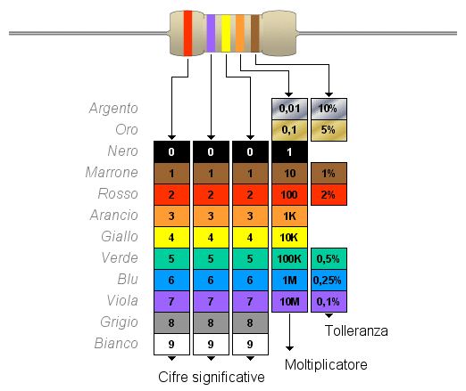

# Esercitazione 4 - Javascript

In questa esercitazione il risultato deve corrispondere alla registrazione:

<video width="1000" height="600" controls>
  <source src="lesson/assets/recording.mp4" type="video/mp4">
</video>

Si ricorda inoltre che:
> Tutti i file `.html`, `.test.js` o `.test.css` sono da considerarsi bloccati e non vanno toccati!

> **TIP**: Per svolgere la consegna dovete capire come sfruttare gli eventi click e calcolare in base
> al valore selezionato in ogni tendina.

## La codifica a 5 colori delle resistenze



Nella codifica a 5 bande delle resistenze le prime 3 servono a dare il valore nominale
della resistenza, la quarta rappresenta la potenza di 10 a cui bisogna moltiplicare il
valore nominale, mentre la quinta banda rappresenta una tolleranza in %.

La formula è quindi:

```
Valore resistenza = valori_prime_3_bande * (10 elevato alla valore_quarta banda) 
Tolleranza = valore_quinta_banda
```

Ecco un comodo calcolatore per prendere spunto:

https://www.digikey.it/it/resources/conversion-calculators/conversion-calculator-resistor-color-code

## La libreria Math - elevare a potenza

La libreria `Math` contiene alcune funzioni utili per eseguire operazioni matematiche, come
generazione casuale, arrotondamenti e altro.

In questa esercitazione torna utile la funzione `Math.pow(valore, esponente)`.

``` javascript
const risultato = Math.pow(10, 5);
console.log("risultato", risultato); // stampa "risultato 100000"
```

## I campi ".selected*"

Gli elementi di tipo `<select>` quando ottenuti tramite Javascript hanno alcuni
campi interessanti:

- `.selectedIndex`: rappresenta l'indice dell'elemento selezionato rispetto all'elenco di opzioni.
- `.value`: rappresenta il valore corrispondente all'elemento selezionato 
- `.options`: rappresenta l'array delle opzioni selezionabili.

Ad esempio in una situazione del genere:
``` HTML
<select id="example-select">
  <option value="1">uno</option>
  <option value="-1" selected>meno uno</option>
  <option value="2">due</option>
</select>
```

``` javascript
const example_select = document.getElementById("example-select");
// stampa "example_select.selectedIndex 1
console.log("example_select.selectedIndex", example_select.selectedIndex);
// stampa selectedValue -1
console.log("selectedValue", example_select.options[example_select.selectedIndex].value);
// stampa selectedvalue -1
console.log("selectedValue", example_select.value);
```

## L'evento "load"

Abbiamo visto che occorre mettere i file script "in fondo alla pagina" (sia tramite `defer` che 
mettendoli fisicamente alla fine del `body`).

Esiste tuttavia un evento speciale che viene sparato al primo caricamento della pagina: questo 
evento prende il nome di load e può essere agganciato in più modi:

``` javascript
window.onload = function() {
  // fai qualcosa al caricamento della pagina
}

// oppure

window.addEventListener("load", function () {
  // fai qualcosa al caricamento della pagina
});
```

Scrivendo le istruzioni all'interno di queste funzioni, la necessità di mettere al fondo lo
script viene meno, permettendoci di eseguire codice in maniera più ordinata.


> Esercitazione a opera di [***Alessandro Sanino***](https://linkedin.com/in/alessandrosanino)
