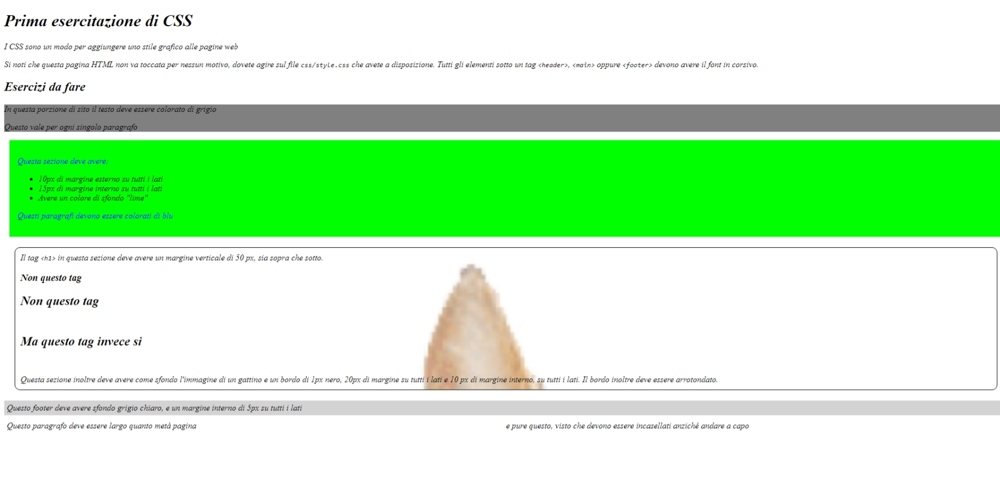
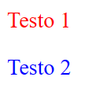
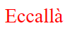
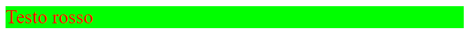
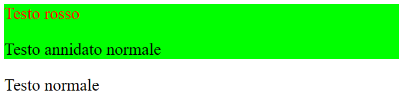
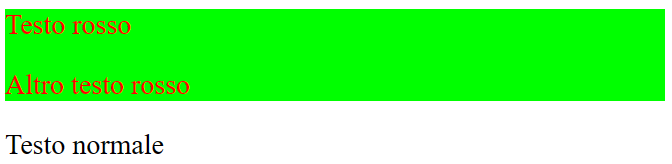
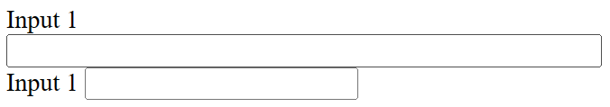

# Esercitazione 1 - CSS e CSS3

In questa esercitazione le istruzioni sono direttamente nel file HTML che vi trovate nella REPL.



# Il linguaggio CSS

Il linguaggio CSS permette di definire regole di stile, che possiamo
applicare a degli elementi HTML per dare varie impostazioni di carattere
grafico/stilistico (per esempio dimensioni, margini, font, etc...)

Per inserire blocchi CSS nelle nostre pagine abbiamo più opzioni:

## Attributo `style`

**Per quanto altamente sconsigliato**, è possibile inserire una stringa di codice CSS come valore per l'attributo `style` di un elemento.

``` HTML
<p style="color: red;">Testo rosso</p>
```

## Tag `<style>`

Un altro metodo sconsigliato, ma comunque ordinato, è di usare un tag style dentro la nostra pagina HTML per definire le nostre regole.

``` HTML
<style>
  p {
    color: red;
  }
</style>
<p>Testo rosso</p>
```

> Creare più di un blocco style porta facilmente a confondersi,
> pertanto si sconsiglia di usarne più di uno per ragioni di ordine.

## Files CSS

Il metodo dei file CSS è quello consigliato e consiste nel creare
uno (o più) file CSS che contengono le nostre regole, e di collegarli
alla pagina tramite il tag `link`.

> **NOTA**: nelle verifiche questo è il metodo più giusto da usare sempre.

``` HTML
<html>
  <head>
    <link href="css/style.css" rel="stylesheet" type="text/css">
  </head>
  <body>
    <p>Testo rosso</p>
  </body>
</html>
```

# I selettori CSS

Il linguaggio CSS mette a disposizione una maniera per selezionare specifici elementi
nella pagina, al fine di applicargli le regole di stile.

## Il selettore di tag

Il selettore di tag permette di selezionare tutti gli elementi che hanno
un determinato tag.

``` HTML
<p>Testo 1</p>
<span>Testo 2</span>
```

``` CSS 
p {
  color: red;
}

span {
  color: blue;
}
```



## Il selettore di id `#`

Il selettore di id permette di selezionare un elemento dato il suo ID.

``` HTML
<p id="mio-paragrafo">Eccallà</p>
```

``` CSS
#mio-paragrafo {
  color: red;
}
```


## Il selettore di classe `.`

Il selettore di classe permette di selezionare tutti i tag che
condividono la medesima classe.

``` HTML
<div class="contenitore">
  <p>Testo rosso</p>
</div>
```

``` CSS
.contenitore {
  background-color: lime;
}

p {
  color: red;
}
```



## Il selettore dei figli `>`

Questo selettore permette di selezionare i tag
immediatamente annidati sotto i tag catturati da
un altro selettore.

``` HTML
<div class="contenitore">
  <p>Testo rosso</p>
  <div>
    <p>Testo annidato normale</p>
  </div>
</div>
<p>Testo normale</p>
```

``` CSS
.contenitore {
  background-color: lime;
}

.contenitore > p {
  color: red;
}
```



## Il selettore dei discendenti

Il selettore dei discendenti si comporta come
quello dei figli, ma scende in profondità oltre
il primo livello di annidamento.

``` HTML
<div class="contenitore">
  <p>Testo rosso</p>
  <div>
    <p>Altro testo rosso</p>
  </div>
</div>
<p>Testo normale</p>
```

``` CSS
.contenitore {
  background-color: lime;
}

.contenitore p {
  color: red;
}
```



## Il selettore su attributi

Questo selettore funziona solo se in combinazione con un
altro selettore, aggiungendo un filtro su specifici attributi.

Per esempio:

``` HTML
<form action="..." method="post">
  <div>
    <label for="input-testo">Input 1</label>
    <input type="text" name="input-testo" id="input-testo">    
  </div>
  <div>
    <label for="input-pass">Input 1</label>
    <input type="password" name="input-pass" id="input-pass">
  </div>
</form>
```

``` CSS
input[type="text"] {
  width: 100%;
}
```

condurrà al filtro aggiuntivo
sull'attributo `type` degli input
selezionati (`type` deve essere uguale a `text`):



## Il selettore totale `*`

Il selettore totale semplicemente seleziona tutti i tag selezionabili.

Di solito si usa in combinazione con altri tag, ma si può usare anche per definire regole globali.

``` HTML
<p>Paragrafo</p>
<span>Testo</span>


<div id="contenitore-esempio">
  <p>Paragrafo rosso</p>
  <span>Testo rosso</span>
</div>
```

``` CSS
* {
  font-style: bold;
}

img {
  width: 50px;
}

#contenitore-esempio > * {
  color: red;
}
```


> Esercitazione a opera di [***Alessandro Sanino***](https://linkedin.com/in/alessandrosanino)
