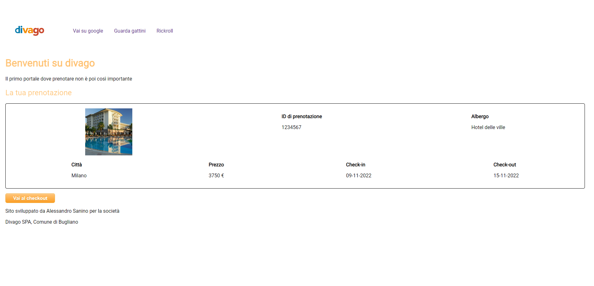
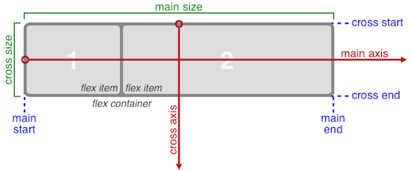

# Esercitazione 3 - CSS e CSS3

In questa esercitazione dobbiamo riprodurre il seguente layout

Questa esercitazione, oltre al file `css/custom.css` che dovete riempire voi, contiene
anche un altro file `css/awesome-styles.css` che dovete importare e potete usare,
ma non lo potete modificare (vi permetterà di aggiungere un po' di colore in più).

Vediamo ora come possiamo sfruttare un nuovo tipo di layout chiamato `flexbox`

> **NOTA**: Potete trovare un comodo riassunto con disegni al seguente URL
> 
> https://css-tricks.com/snippets/css/a-guide-to-flexbox
>
> In questa esercitazione, al fondo è presente un cheat-sheet proprio preso da
> la!

## Il layout flexbox

Flexbox è sicuramente una tra le più promettenti delle specifiche CSS,
non fosse altro che il suo campo di azione si estende alla base stessa
del web design: la strutturazione del layout.

Per quanto ci riguarda, svolgeremo qui una panoramica molto concreta
e pratica su questa promettente tecnica CSS, presentando diversi modi
in cui flexbox può essere utilizzato in contesti d'uso reali.

In particolare ci occuperemo di:
- centratura orizzontale e verticale di elementi;
- realizzazioni di menu di navigazione orizzontali basati su liste;
- allineamento con i margini automatici;
- realizzazione di colonne di altezza uguale;
- layout a griglia;

A livello tecnico-implementativo, prima di iniziare a usare il flexbox
è necessario comprendere alcuni concetti di base.

In sintesi sono rappresentati in questa immagine presa direttamente dal
documento del W3C.

Il sistema è fondato su due elementi costitutivi:

- **un elemento contenitore** (flex container): contiene i box flessibili
  e viene creato usando il valore CSS `display: flex`
- **box flessibili** (flex items): gli elementi figli dell'elemento contenitore
  che assumono come loro caratteristica fondamentale quella della 'flessibilità'.
  > Su questi box non hanno effetto le proprietà `float` e `vertical-align`.
  
Di fatto, il modello di layout del flexbox prevede in prima istanza la
dichiarazione di un elemento contenitore e delle sue proprietà di base,
quindi l'impostazione del comportamento dei singoli box al suo interno.

Le proprietà possono pertanto essere suddivise in due gruppi:
1. quelle che si applicano al contenitore
1. quelle che si applicano ai box flessibili.

Le prime sono:

| Proprietà         | possibili valori | Descrizione 
| ----------------- | ---------------- | ----------- 
| `display: flex`   |  | &Egrave; il valore della proprietà display con cui si imposta un contenitore flessibile
| `flex-direction`  | `row` `row-reverse` `column` `column-reverse` | La direzione dell'asse principale (main axis) su cui si dispongono i box flessibili nel contenitore
| `flex-wrap`       | `nowrap` `wrap` `wrap-reverse` | Specifica se i box all'interno del contenitore si dispongono su una riga o su più righe in base allo spazio disponbile
| `justify-content` | `flex-start`  `flex-end`  `center`  `space-between`  `space-around` | Stabilisce la modalità di allineamento dei box flessibili sull'asse principale del contenitore
| `align-items`     | `stretch`  `flex-start`  `flex-end`  `center`  `baseline` | Specifica l'allineamento dei box flessibili lungo l'asse perpendicolare (cross axis) all'asse principale
| `align-content`   | `stretch`  `flex-start`  `flex-end`  `center`  `space-between`  `space-around` | Gestisce l'allineamento di una riga di box flessibili lungo l'asse perpendicolare. Ha effetto solo su contenitori multi-riga

Le seconde sono:
| Proprietà         | possibili valori | Descrizione 
| ----------------- | ---------------- | ----------- 
| `flex`            | qualsiasi numero | Imposta il fattore di ingrandimento di un box rispetto agli altri presenti nel contenitore quando si distribuisce lo spazio disponbile
| `align-self`      | `stretch`  `flex-start`  `flex-end`  `center`  `baseline` | Come `align-items` ma si applica solo all'elemento a cui è applicato e non a tutti

Eccovi un comodo riassunto di tutto in forma di comoda immagine

> Esercitazione a opera di [***Alessandro Sanino***](https://linkedin.com/in/alessandrosanino)
