# Esercitazione 4 - HTML e HTML5  


In questa esercitazione andremo a creare completamente da zero il sito del comune di Bugliano.

Questo sito è composto da un sacco di pagine e fa un uso massiccio dei form.

> **NOTA:** Laddove non diversamente specificato, tutti i campi dei form sono da
> considerarsi obbligatori.
>
> Il sito del campo minato che dovete mettere nel link è https://onesquareminesweeper.com
>
> Le emoji che dovete usare sono ✔️ e ❌.

## index.html

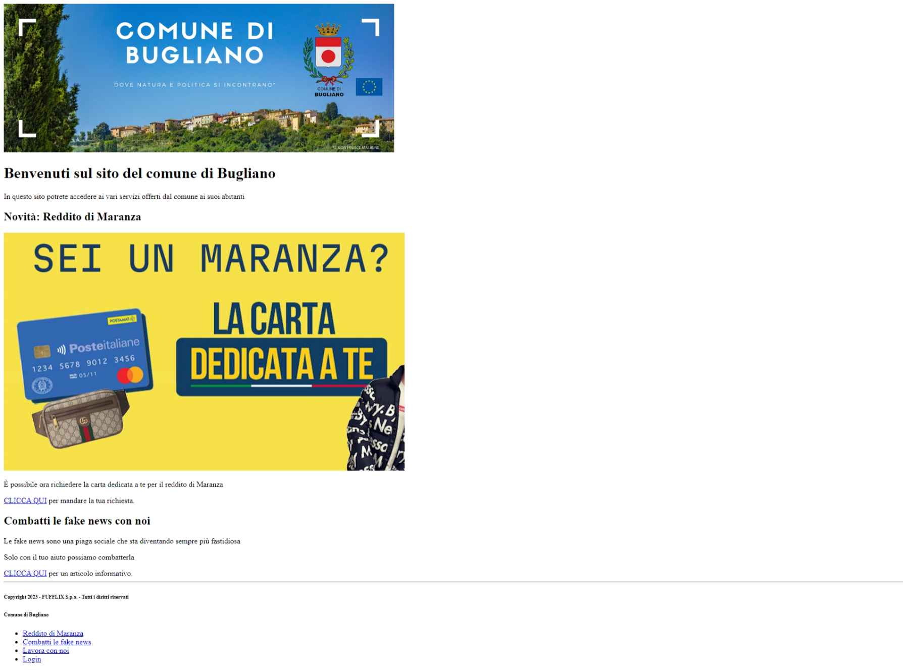

## combatti-fake-news.html


## lavora-con-noi.html

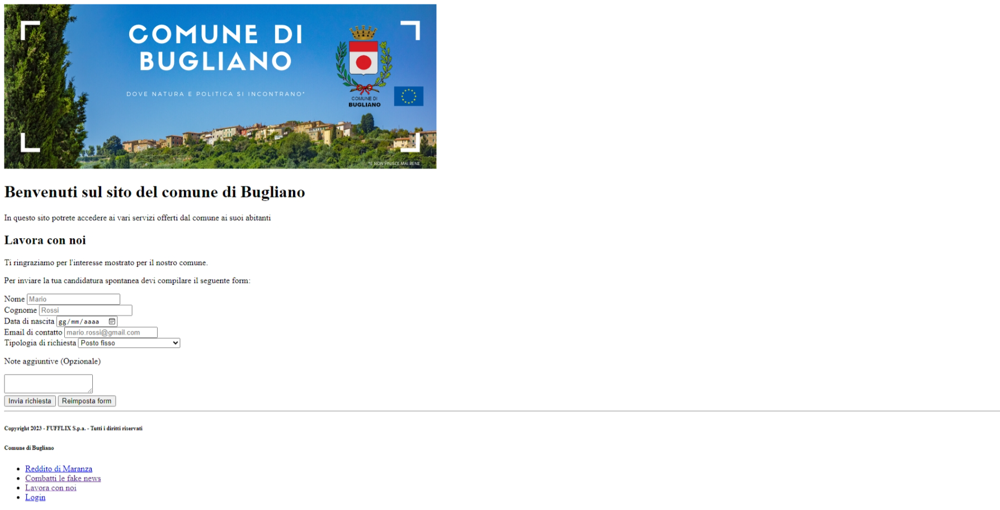
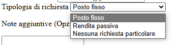

## reddito-di-maranza.html

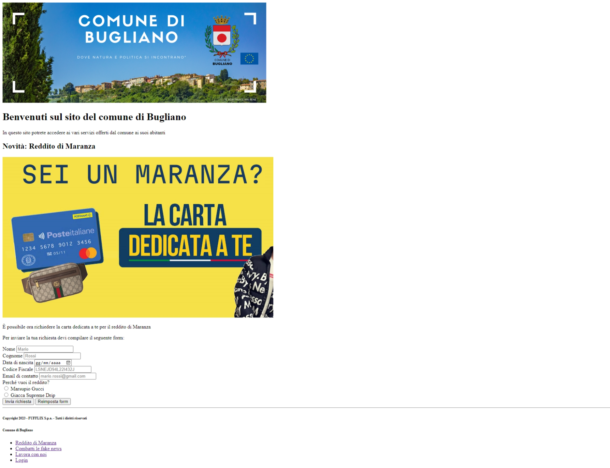

## richiesta-ok.html

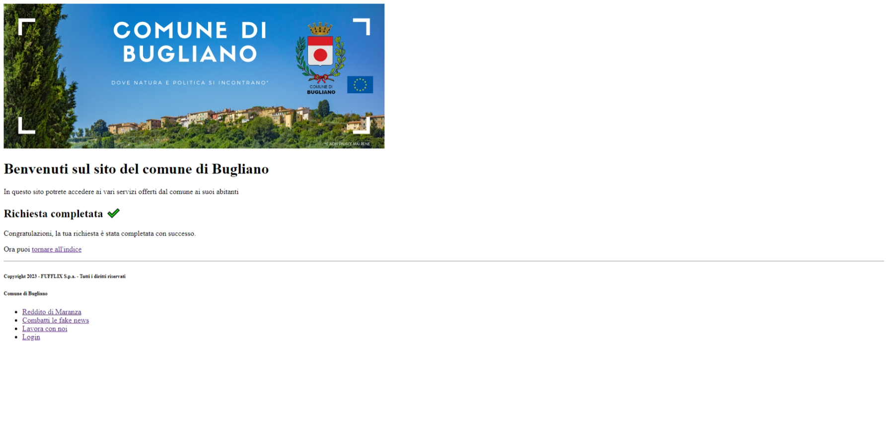

## login.html


## login-ok.html


# Suggerimenti Operativi

In questa sezione vedremo alcuni tag nuovi e capiremo come creare dei moduli da inviare a server
remoti

## Contattare server remoti: i forms

I form permettono all'utente di inserire nella pagina web informazioni di vario genere, le quali
possono essere inviate a un server per essere processate.

A tale scopo si usa il tag `<form>`:

``` HTML
<form action="<pagina-destinazione>" method="post">
    <!--
    metto qui dentro i vari "controls" per
    chiedere informazioni all'utente
    -->
</form>
```

L'unico attributo che al momento è interessante andare ad approfondire è l'attributo `action`.
Esso permette di specificare la risorsa verso la quale i dati contenuti nel form verranno inviati.
Nel caso in cui la risorsa sia una pagina HTML, essa verrà aperta al momento dell'invio del form.

All'interno di ogni form vado a inserire elementi che servono a raccogliere informazioni, che
prendono il nome di form controls.

Ogni form control è caratterizzato da un attributo `name` che deve essere univoco all'interno del
form e da un attributo `id`, univoco in tutta la pagina. Nel 90% dei casi questi due campi collidono.

``` HTML
<form action="..." method="post">
  <input type="text" name="first-name" id="first-name">
</form>
```

> **NOTA:** se voglio rendere obbligatorio un campo di un form, devo dotare questo campo dell'attributo
> `required`:
> ``` HTML
> <input type="text" name="first-name" id="first-name" required>
> <button type="submit"> Invia </button>
> ```
>
> 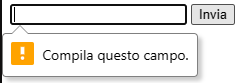

Qui di seguito ecco alcuni esempi:

### Etichettare : le `<label>`

Il tag `<label>` si usa per dare delle etichette agli altri campi e mostrare del testo esplicativo:

``` HTML
<form action="..." method="post">
  <label for="first-name">Nome</label>
  <!-- 
    in questo esempio "first-name" è il name
    del campo etichettato dalla nostra label
  -->
  <input type="text" name="first-name" id="first-name">
</form>
```

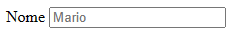

### Acquisire testi - `<input>` e `<textarea>`

Il tag `<input>` permette di acquisire in un form informazioni testuali di vario tipo.

``` HTML
<form action="..." method="post">
  <div>
    <label for="first-name">Nome</label>
    <input type="text" name="first-name" id="first-name" placeholder="Mario">
  </div>
</form>
```


Analizziamo insieme i vari attributi che è possibile impostare:

| Attributo | Significato | Default | Valori possibili |
| --------- | ----------- | ------- | ---------------- |
| `type`    | Tipologia di testo da acquisire | `text` | `text` -> testo generico
|           |                                        | | `email` 
|           |                                        | | `number` -> accetto solo numeri
|           |                                        | | `password` -> nasconde i caratteri digitati
|           |                                        | | `date` -> data / ora
|           |                                        | | `url` -> generici indirizzi web (URL)
|           |                                        | | `range` -> range di valori numerici
| `name`    | Identificativo del control nel form      | `""` | qualsiasi stringa
| `id`      | Identificativo del control nella pagina  | `""` | qualsiasi stringa
| `placeholder` | Campo "anteprima" che viene mostrato in assenza di input | `""` | qualsiasi stringa
| `required` | Se presente, il campo è obbligatorio | (non presente) |

> NOTA: se `type="range"` viene specificato occorre specificare anche altri attributi
>
> ``` HTML
> <input type="range" min="<minimo>" max="<massimo>" step="<incremento>">
>
> <!-- per esempio -->
> <input type="range" min="1" max="10" step="0.5">
> ```
>
> 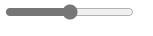

Quando il testo che dobbiamo raccogliere in input va a occupare più righe, il tag `<textarea>` ci viene
in soccorso:

``` HTML
<textarea name="..." id="..." placeholder="..."></textarea>
```

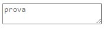

Qui è possibile specificare i seguenti attributi:

| Attributo | Significato | Default | Valori possibili |
| --------- | ----------- | ------- | ---------------- |
| `name`    | Identificativo del control nel form      | `""` | qualsiasi stringa
| `id`      | Identificativo del control nella pagina  | `""` | qualsiasi stringa
| `placeholder` | Campo "anteprima" che viene mostrato in assenza di input | `""` | qualsiasi stringa
| `required` | Se presente, il campo è obbligatorio | (non presente) |

### Selezionare valori: `<select>` e `<option>`

Per scegliere un valore in una lista a discesa si può usare i tag `<select>` e `<option>`

``` HTML
<form action="..." method="post">
  <select name="..." id="...">
    <option value="-1" selected>Seleziona un numero</option>
    <option value="1">UNO</option>
    <option value="2">DUE</option>
    <option value="3">TRE</option>
    <option value="4">QUATTRO</option>
    <option value="5">CINQUE</option>
  </select>
</form>
```

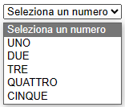

> NOTA: è possibile una selezione multipla specificando l'attributo `multiple`
>
> ``` HTML
> <form action="..." method="post">
>   <select name="..." id="..." multiple>
>     <option value="-1" selected>Seleziona un numero</option>
>     <option value="1">UNO</option>
>     <option value="2">DUE</option>
>     <option value="3">TRE</option>
>     <option value="4">QUATTRO</option>
>     <option value="5">CINQUE</option>
>   </select>
> </form>
> ```
>
> 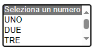

### Selezioni di un valore fra gruppi : Radio e check controls

Per selezionare un valore in una lista esplicita di valori (ogni valore è rappresentato)
da un bottone e solo uno di loro può essere selezionato per gruppo) si usano i
radio buttons, così rappresentati

``` HTML
<form action="..." method="post">
  <div>
    <input type="radio" name="nome-input-radio-1" id="nome-input-radio-1-1" value="valore 1.1" />
    <label for="nome-input-radio-1-1">Valore 1.1</label>
  </div>
  <div>
    <input type="radio" name="nome-input-radio-1" id="nome-input-radio-1-2" value="valore 1.2" />
    <label for="nome-input-radio-1-2">Valore 1.2</label>
  </div>
  <div>
    <input type="radio" name="nome-input-radio-1" id="nome-input-radio-1-3" value="valore 1.3" />
    <label for="nome-input-radio-1-3">Valore 1.3</label>
  </div>
  <div>
    <input type="radio" name="nome-input-radio-1" id="nome-input-radio-1-4" value="valore 1.4" />
    <label for="nome-input-radio-1-4">Valore 1.4</label>
  </div>
  <br>
  <div>
    <input type="radio" name="nome-input-radio-2" id="nome-input-radio-2-1" value="valore 2.1" />
    <label for="nome-input-radio-2-1">Valore 2.1</label>
  </div>
  <div>
    <input type="radio" name="nome-input-radio-2" id="nome-input-radio-2-2" value="valore 2.2" />
    <label for="nome-input-radio-2-2">Valore 2.2</label>
  </div>
  <div>
    <input type="radio" name="nome-input-radio-2" id="nome-input-radio-2-3" value="valore 2.3" />
    <label for="nome-input-radio-2-3">Valore 2.3</label>
  </div>
  <div>
    <input type="radio" name="nome-input-radio-2" id="nome-input-radio-2-4" value="valore 2.4" />
    <label for="nome-input-radio-2-4">Valore 2.4</label>
  </div>
</form>
```

> 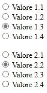

Qualora volessimo permettere la scelta multipla occorre cambiare `radio` in `checkbox`:

``` HTML
<form action="..." method="post">
  <div>
    <input type="checkbox" name="nome-input-checkbox-1" id="nome-input-checkbox-1-1" value="valore 1.1" />
    <label for="nome-input-checkbox-1-1">Valore 1.1</label>
  </div>
  <div>
    <input type="checkbox" name="nome-input-checkbox-1" id="nome-input-checkbox-1-2" value="valore 1.2" />
    <label for="nome-input-checkbox-1-2">Valore 1.2</label>
  </div>
  <div>
    <input type="checkbox" name="nome-input-checkbox-1" id="nome-input-checkbox-1-3" value="valore 1.3" />
    <label for="nome-input-checkbox-1-3">Valore 1.3</label>
  </div>
  <div>
    <input type="checkbox" name="nome-input-checkbox-1" id="nome-input-checkbox-1-4" value="valore 1.4" />
    <label for="nome-input-checkbox-1-4">Valore 1.4</label>
  </div>
  <br>
  <div>
    <input type="checkbox" name="nome-input-checkbox-2" id="nome-input-checkbox-2-1" value="valore 2.1" />
    <label for="nome-input-checkbox-2-1">Valore 2.1</label>
  </div>
  <div>
    <input type="checkbox" name="nome-input-checkbox-2" id="nome-input-checkbox-2-2" value="valore 2.2" />
    <label for="nome-input-checkbox-2-2">Valore 2.2</label>
  </div>
  <div>
    <input type="checkbox" name="nome-input-checkbox-2" id="nome-input-checkbox-2-3" value="valore 2.3" />
    <label for="nome-input-checkbox-2-3">Valore 2.3</label>
  </div>
  <div>
    <input type="checkbox" name="nome-input-checkbox-2" id="nome-input-checkbox-2-4" value="valore 2.4" />
    <label for="nome-input-checkbox-2-4">Valore 2.4</label>
  </div>
</form>
```

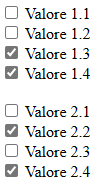

> **NOTA:** è possibile preimpostare una selezione tramite l'attributo `checked`, sia per i radio che per i checkbox:
>
> ``` HTML
> <input type="radio" name="..." id="..." value="..." checked />
> <input type="checkbox" name="..." id="..." value="..." checked />
> ```

### Raggruppare controls diversi : `<legend>` e `<fieldset>`

Qualora avessimo più controls in un form che fanno logicamente parte dello stesso gruppo, è possibile
evidenziarlo con i tag `<legend>` e `<fieldset>`:

``` HTML
<form action="..." method="post">
  <fieldset>
    <legend>Dati anagrafici</legend>
    <div>
      <label for="first-name">Nome:</label>
      <input type="text" name="first-name" id="first-name" placeholder="Mario">
    </div>
    <div>
      <label for="last-name">Cognome:</label>
      <input type="text" name="last-name" id="last-name" placeholder="Rossi">
    </div>
    <button type="submit">Invia</button>
  </fieldset>
</form>
```

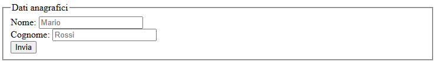

## Invio di dati: i buttons

Per inviare i dati di un form occorre predisporre un bottone che viene chiamato di "submit" (invio).

&Egrave; possibile aggiungere un bottone in questo modo:

``` HTML
<form action="..." method="post">
  <!-- bottone normale, nessun effetto (serve javascript) -->
  <input type="button" id="..." value="Cliccami">
  <button id="...">Cliccami</button>

  <!-- Bottone di submit, invia i dati del form in cui è contenuto -->
  <input type="submit" value="Invia">
  <button type="submit">Invia</button>

  <!-- Bottone di reset, reimposta e svuota i dati del form in cui è contenuto -->
  <input type="reset" value="Reimposta">
  <button type="reset">Reimposta</button>
</form>
```

> **NOTA:** anche i bottoni hanno un `id`, ma fino a che non faremo javascript non
> ci servirà impostarlo!

Buon lavoro!

> Esercitazione a opera di [***Alessandro Sanino***](https://linkedin.com/in/alessandrosanino)
