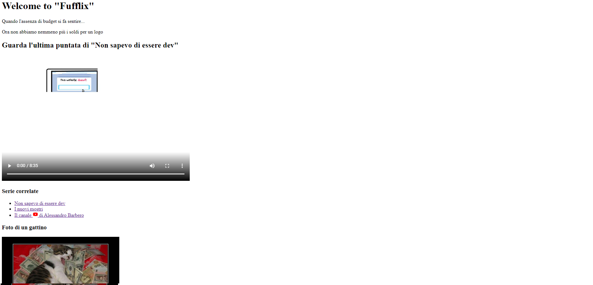
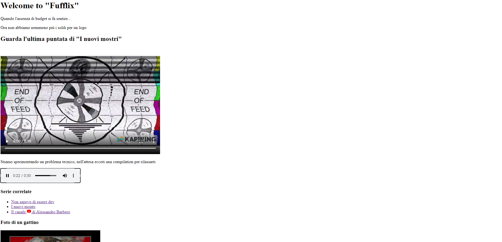

# Esercitazione 3 - Fufflix and Chill

In questa esercitazione andremo a mostrare il seguente scenario, usando i nuovi tag 
`HTML` appresi nelle lezioni precedenti

## Scenario

Siete parte del team di sviluppo di Fufflix, una innovativa piattaforma di streaming 
di videocorsi sulla fuffa. Il vostro capo area vi ha commissionato la creazione di 
una pagina `HTML`. Questi sono i loro commenti:

- La vogliamo innovativa
- Vogliamo più video!
- Deve esser pronto per ieri

Il team lead del vostro team ha affrontato a muso duro questi requisiti poco chiari 
e ha prodotto un mock up che potete trovare qui

### index.html


### nuovi-mostri.html


Vi sono state date anche altre istruzioni, più specifiche:

- avete una sezione di navigazione e una sezione di video
- avete una sezione dove dovete mostrare un player nativo `HTML5` che punta a un 
  video che avete caricato nella vostra area di lavoro, nella cartella .lesson/assets/video
- è assolutamente vietato usare gli `<iframe>`: noi abbiamo i contenuti video, non 
  sono né su soundcloud né su youtube
- non voglio vedere né `CSS` né `Javascript` di alcun tipo, abbiamo i reparti 
  dedicati per quello

Vi sono stati dati anche dei suggerimenti operativi per lavorare al meglio

### Suggerimenti operativi

Qui di seguito verranno spiegati alcuni dei tag che potete usare per completare 
l'esercitazione:

#### Cosa significa "semantico"?
Dal web
> In linguistica, la componente semantica di una parola, insieme con le componenti
> fonologica e sintattica, **concorre a determinarne il significato nel discorso**

In pratica significa che il contenuto di un tag oltre ad avere un suo significato 
**sintattico** (_contenitore_, _paragrafo_) possiede nuovi significati, che servono 
a dare contesto/significato.

Un esempio di tag semantico per antonomasia è `<article>` che sintatticamente si 
comporta come un tag `<div>` ma ha un significato di contesto (ovvero "Articolo di 
giornale / Articolo di blog / etc...")

#### Il tag `<span>`

Il tag `<span>` è un tag `HTML` che permette di definire un contenitore di altri
tag.

Quando due `<span>` sono vicini, si mettono uno a fianco all'altro.
> **NOTA**: questo comportamento viene definito `inline`

``` HTML
<span>Testo di prova</span>
<span>Testo di prova 2</span>
```

L'obiettivo di questo tag serve per poter aggiungere CSS senza alterare la visualizzazione


#### Il tag `<div>`

Il tag `<div>` è un tag `HTML` che permette di definire un contenitore di altri tag.

Come per il tag `<p>` quando due `<div>` sono vicini, vanno automaticamente a capo
> **NOTA**: questo comportamento viene definito `block`

``` HTML
<div>
    <span>Testo di prova</span>
    
</div>
<div>
    <span>Testo di prova 2</span>
    
</div>
```

#### I tags `<audio>` e `<video>`

I seguenti tag servono rispettivamente a mostrare contenuti audio e video agli 
utenti.

Il loro uso richiede una URL oppure un path al contenuto da riprodurre (deve essere 
un file, non una pagina web!)

``` HTML
<!--
  controls -> abilita i bottoni
              nel nostro player 
-->
<audio controls>
    <source
        src="./audio/prova-audio.mp3"
        type="audio/mpeg"
    >
    <!--
      Questa scritta compare come fallback in caso il tag audio
      non sia supportato, quindi usatela per mostrare un messaggio di errore.
      Ad esempio 
    -->
    Impossibile mostrare il contenuto: il tuo browser non
    è aggiornato
</audio>

<video height="200" width="500" controls>
    <source
        src="./video/prova-video.mp4"
        type="video/mp4"
    >
    Impossibile mostrare il contenuto: il tuo browser non
    è aggiornato
</video>
```

#### Il tag `<nav>`

Il tag `<nav>` è un tag `HTML5` che permette di definire in maniera semantica una 
barra di navigazione.

``` HTML
<nav>
    <ul>
        <li>
            <a href="./home.html">
                Home page
            </a>
        </li>
        <li>
            <a href="./video-piu-visti.html">
                I video più visti
            </a>
        </li>
    </ul>
</nav>
```

> **NOTA**: In realtà dentro il tag `<nav>` potete mettere i tag che volete, di fatto si
> comporta come un tag `<div>`, quello che cambia è il significato semantico che
> viene dato.

#### I tag `<header>`, `<main>` e `<footer>`

Questi tag rappresentano un significato semantico all'interno del tag in cui sono
contenuti:

- `<header>` -> l'intestazione del contenuto
- `<main>` -> il corpo principale del contenuto
- `<footer>` -> il "pié di pagina" del contenuto

Normalmente sono contenuti all'interno del tag `<body>`, il che significa che sono,
rispettivamente, intestazione, corpo principale e pié della pagina.

``` HTML
<html>
    <head>
        <!-- ... --->
    </head>
    <body>
        <header>
            <!-- esempio --->
            <nav>
                <!-- ... --->
            </nav>
        </header>
        <main>
            <p>
                Il mio sito HTML5
            </p>
        </main>
        <footer>
            <p>
                Tutti i diritti riservati @Vallauri
            </p>
        </footer>
    </body>
</html>
```

#### Il tag `<section>`

Questo tag serve a raggruppare porzioni di pagina che semanticamente sono correlate

``` HTML
<section>
    <h2>I meme nella storia</h2>
    <p>In passato i meme non erano su internet</p>
</section>
<section>
    <h2>I meme nel mondo moderno</h2>
    <p>Ora i meme sono su internet</p>
</section>
```

#### Il tag `<article>`

Questo tag dice che il suo contenuto rappresenta semanticamente un articolo, sia esso di giornale, un blog post oppure un altro contenuto editoriale.

``` HTML
<article>
    <h2>I meme nella storia</h2>
    <p>In passato i meme non erano su internet</p>
    <p>Ecco a voi un articolo a riguardo</p>
    <p>...</p>
</article>
```

##### Attenzione

I tag `<article>` e `<section>` sono collegati fra loro in modi diversi

In questo esempio il tag `<section>` assume il significato semantico di "porzione di articolo"

``` HTML
<article>
    <section>
        <h2>I meme nella storia</h2>
        <p>In passato i meme non erano su internet</p>
        <p>Ecco a voi un articolo a riguardo</p>
        <p>...</p>
    </section>
    <section>
        <h2>I meme nel presente</h2>
        <p>...</p>
    </section>
    <section>
        <h2>I meme nel futuro</h2>
        <p>...</p>
    </section>
</article>
```

In questo esempio il tag `<section>` assume il significato semantico di "porzione di pagina, e l'articolo è al suo interno"

``` HTML
<section>
    <article>
        <h2>I meme nella storia</h2>
        <p>In passato i meme non erano su internet</p>
        <p>Ecco a voi un articolo a riguardo</p>
        <p>...</p>
    </article>
</section>
```

> **NOTA**: Meglio usare `<article>`, `<section>` oppure `<div>`?
>
> La risposta è "dipende", ma qui potete avere un'idea
>
> https://www.html.it/articoli/html5-section-o-article-e-il-div/

#### I tag `<thead>` e `<tbody>`

Questi 2 tag vanno ad aggiungere un significato semantico all'intestazione e al corpo di una tabella
Ecco il loro uso

``` HTML
<table>
    <thead>
        <tr>
            <th>#</th>
            <th>Colonna 1</th>
        </tr>
    </thead>
    <tbody>
        <tr>
            <td>1</td>
            <td>Valore 1</td>
        </tr>
    </tbody>
</table>
```

Buon lavoro!

> Esercitazione a opera di [***Alessandro Sanino***](https://linkedin.com/in/alessandrosanino)
